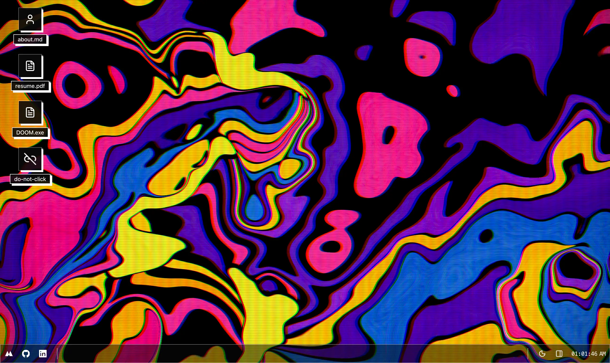

  
  <h1><a href="https://www.robertmolina.dev/">My Personal Website</a></h1>

  
  

This is an OS-inspired personal site with a desktop shell, windowed apps, and playful system interactions.
The experience is meant to feel like a lightweight desktop: icons on the wallpaper, windowed apps, and system overlays.

---

## Repository Structure

This is a monorepo powered by [Turborepo](https://turborepo.dev/) and [pnpm](https://pnpm.io/). See [`pnpm-workspace.yaml`](./pnpm-workspace.yaml) for monorepo layout.

---

## What Lives Here

- **Web Application:** Found in [`apps/web`](./apps/web). Powered by TanStack Start, built by Vite and Nitro.
- **Packages**: Found in [`packages`](./packages). Includes UI components, OS-themed windowing system, and other shared utilities.
- **Specs:** Found in [`specs`](./specs). Includes product specifications, roadmaps, and other documentation.

---

## Architecture

### Core Logic

- [`apps/web/src/routes`](./apps/web/src/routes): Tanstack Router is used to orchestrate navigation and routing within the application.
- [`apps/web/src/routes/-components`](./apps/web/src/routes/-components): Includes the website's core components, such as the System, Desktop, Applications, and OS-themed framework integration.

### Component Library

- [`packages/ui/src/os`](./packages/ui/src/os): This is the implementation of the OS-themed components.

### Styling

- [`apps/web/src/styles.css`](./apps/web/src/styles.css): These are the CSS styles of the website.
- [`packages/ui/src/styles.css`](./packages/ui/src/styles.css): And these are the base CSS styles of the pure components.

### Stories

- [`apps/web/src/stories`](./apps/web/src/stories): These are the stories of the website's components. This is a playground to experiment with the components and it's mostly used by agents to test while developing via Playwright, but it's also used to sanity check a11y, etc.

---

## Roadmap

See the [Roadmap](./specs/roadmap.md) for more details on what's to come.

---

## License

This project is licensed under the MIT License - see the [LICENSE](./LICENSE) file for details.
